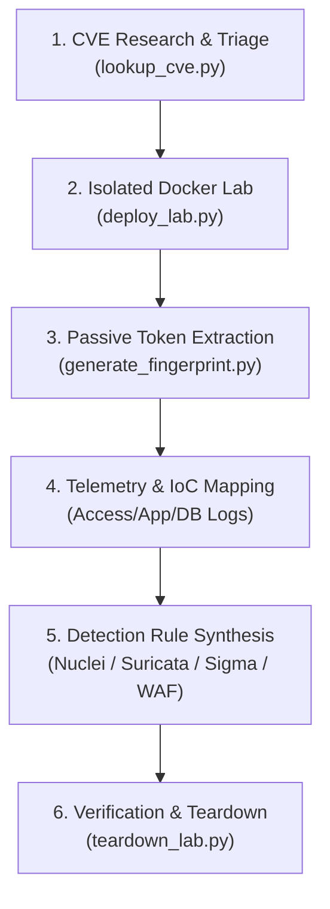

# CVE Docker Lab & Fingerprinting Skill

This skill provides an automated, secure workflow to research CVEs, provision isolated Docker sandbox environments on local loopback, extract non-destructive behavioral fingerprints, map forensic Indicators of Compromise (IoCs), and synthesize defensive detection rules for network defense.

---

## Skill Directory Structure

```text
.agents/skills/cve-fingerprint-lab/
├── SKILL.md                               # Main runbook and procedures
├── scripts/
│   ├── lookup_cve.py                      # Query public vulnerability databases (OSV/CIRCL)
│   ├── deploy_lab.py                      # Provision isolated Docker compose environments
│   ├── generate_fingerprint.py            # Extract service tokens & generate Nuclei/Suricata/Sigma rules
│   └── teardown_lab.py                    # Clean up containers, networks, and temporary volumes
├── references/
│   ├── cve_reproduction_playbook.md       # Master end-to-end reproduction lifecycle & GeoServer case study
│   ├── containeryard_and_sources.md       # Registries & image discovery guide
│   ├── fingerprint_methodology.md         # Signature syntax & heuristic extraction standards
│   └── isolation_guidelines.md            # Container security, sandboxing & resource throttling
└── examples/
    ├── example_compose.yml                # Template for safe container sandboxing
    ├── example_nuclei_template.yaml       # Sample defensive Nuclei scanner template
    └── example_suricata_rule.rules        # Sample Suricata NIDS rule
```

---

## Operational Workflow



> [!TIP]
> For a full step-by-step case study using a real-world zero-day (GeoServer `jsonArrayContains`), refer to [references/cve_reproduction_playbook.md](./references/cve_reproduction_playbook.md).

---

## Step-by-Step Instructions

### Step 1: CVE Research & Image Discovery
Query public advisories to determine affected versions, vulnerable components, and container images:
```bash
python .agents/skills/cve-fingerprint-lab/scripts/lookup_cve.py --cve CVE-2023-46604
```
Review the advisory references to identify the exact package name, vulnerable release tag, and container image from Docker Hub, ContainerYard, or Vulhub. Refer to [references/containeryard_and_sources.md](./references/containeryard_and_sources.md).

---

### Step 2: Provision Isolated Docker Sandbox
Deploy the container in a quarantined sandbox bound strictly to `127.0.0.1`:
```bash
python .agents/skills/cve-fingerprint-lab/scripts/deploy_lab.py \
  --cve CVE-2023-46604 \
  --image "vulnerable-image:version-tag" \
  --port 8080:8080 \
  --name "cve-2023-46604-lab"
```
*Use `--dry-run` to generate the `docker-compose.yml` file without launching the containers.*

**Mandatory Isolation Controls:**
- Ports MUST bind exclusively to `127.0.0.1` (never `0.0.0.0`).
- Use dedicated internal bridge networks without host gateway exposure.
- Enforce memory and CPU throttles (`--memory 512m --cpus 1.0`).
- Consult [references/isolation_guidelines.md](./references/isolation_guidelines.md).

---

### Step 3: Extract Service Fingerprints & Generate Detection Rules
Probe the running container on loopback to extract high-fidelity defensive signatures:
```bash
python .agents/skills/cve-fingerprint-lab/scripts/generate_fingerprint.py \
  --target http://127.0.0.1:8080 \
  --cve CVE-2023-46604 \
  --format all \
  --output-dir ./generated_rules
```

This generates:
1. **Nuclei Template (`.yaml`)**: High-accuracy passive/behavioral matcher for asset inventory scanning.
2. **Suricata / Snort Rule (`.rules`)**: NIDS signature matching service banners, distinctive protocol tokens, and headers.
3. **Sigma Rule (`.yml`)**: SIEM query for web server access log analysis.
4. **WAF / Proxy Filter**: Immediate reverse proxy blocking rule.

Refer to [references/fingerprint_methodology.md](./references/fingerprint_methodology.md) for tuning signature entropy and minimizing false positives.

---

### Step 4: Map Telemetry & IoCs Across Logging Tiers
Map what happens when the vulnerable endpoint is hit:
* **Web Server Access Logs (`access.log`):** HTTP method, `c-uri-query`, URI parameters.
* **Application Logs (`app.log` / `catalina.out`):** Stack traces, syntax errors, and query parser exceptions.
* **Database Backend Logs (`postgres.log` / `mysql.log`):** Malformed queries and database errors.

---

### Step 5: Document in Obsidian Vault
Log findings according to vault conventions (`AGENTS.md` and `Note Formatting Guide`):
- Add metadata frontmatter: `title`, `type: analysis`, `tags: [defense, detection-engineering, cve]`.
- Record the container environment details, captured banner strings, and the generated detection rules.

---

### Step 6: Clean Teardown
Once fingerprinting and verification are complete, terminate and clean up the lab environment:
```bash
python .agents/skills/cve-fingerprint-lab/scripts/teardown_lab.py --name "cve-2023-46604-lab" --delete-dir
```
