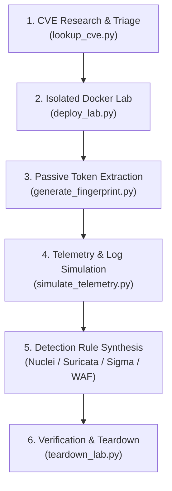

# CVE Docker Lab & Fingerprinting Skill

This skill provides an automated, secure workflow to research CVEs, provision isolated Docker sandbox environments on local loopback, extract non-destructive behavioral fingerprints, generate synthetic multi-tier forensic logs (Auditd, Sysmon, Falco, Access logs), and synthesize defensive detection rules for network defense.

---

## Skill Directory Structure

```text
.agents/skills/cve-fingerprint-lab/
├── SKILL.md                               # Main runbook and procedures
├── scripts/
│   ├── lookup_cve.py                      # Query public vulnerability databases (OSV/CIRCL)
│   ├── deploy_lab.py                      # Provision isolated Docker compose environments
│   ├── generate_fingerprint.py            # Extract service tokens & generate Nuclei/Suricata/Sigma rules
│   ├── simulate_telemetry.py              # Synthesize multi-tier forensic security logs for SIEM testing
│   └── teardown_lab.py                    # Clean up containers, networks, and temporary volumes
├── references/
│   ├── cve_reproduction_playbook.md       # Master end-to-end reproduction lifecycle & GeoServer case study
│   ├── containeryard_and_sources.md       # Registries & image discovery guide
│   ├── fingerprint_methodology.md         # Signature syntax & heuristic extraction standards
│   └── isolation_guidelines.md            # Container security, sandboxing & resource throttling
└── examples/
    ├── example_compose.yml                # Template for safe container sandboxing
    ├── example_geoserver_lab.yml          # GeoServer 2.25.0 test sandbox manifest
    ├── example_nuclei_template.yaml       # Sample defensive Nuclei scanner template
    └── example_suricata_rule.rules        # Sample Suricata NIDS rule
```

---

## Operational Workflow



---

## Step-by-Step Instructions

### Step 1: CVE Research & Image Discovery
Query public advisories to determine affected versions, vulnerable components, and container images:
```bash
python .agents/skills/cve-fingerprint-lab/scripts/lookup_cve.py --cve CVE-2023-46604
```

---

### Step 2: Provision Isolated Docker Sandbox
Deploy the container in a quarantined sandbox bound strictly to `127.0.0.1`:
```bash
python .agents/skills/cve-fingerprint-lab/scripts/deploy_lab.py \
  --cve CVE-2023-46604 \
  --image "vulnerable-image:version-tag" \
  --port 8080:8080 \
  --name "cve-2023-46604-lab"
```

---

### Step 3: Extract Service Fingerprints & Generate Detection Rules
Probe the running container on loopback to extract high-fidelity defensive signatures:
```bash
python .agents/skills/cve-fingerprint-lab/scripts/generate_fingerprint.py \
  --target http://127.0.0.1:8080 \
  --cve CVE-2023-46604 \
  --format all \
  --output-dir ./generated_rules
```

---

### Step 4: Synthesize Forensic Logs & Process Telemetry (For SIEM & Rule Testing)
Generate synthetic forensic log datasets across Web Access, Application Stack, Linux Auditd, and Falco events:
```bash
python .agents/skills/cve-fingerprint-lab/scripts/simulate_telemetry.py \
  --cve CVE-2023-46604 \
  --command "whoami" \
  --output-dir ./simulated_logs
```

---

### Step 5: Clean Teardown
Once testing and verification are complete, dismantle the container lab:
```bash
python .agents/skills/cve-fingerprint-lab/scripts/teardown_lab.py --name "cve-2023-46604-lab" --delete-dir
```
