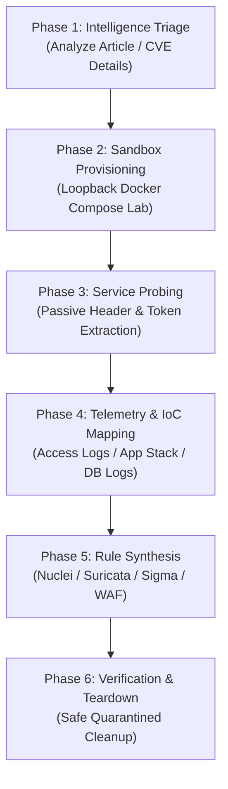

# CVE Reproduction & Detection Engineering Playbook

This playbook documents the exact, repeatable methodology for analyzing any newly disclosed CVE or zero-day article, provisioning an isolated Docker test sandbox, capturing behavioral fingerprints, mapping log Indicators of Compromise (IoCs), and synthesizing multi-layer defensive rules.

---

## The 6-Phase Reproduction Lifecycle



---

## Phase 1: Advisory & Article Triage

When a new vulnerability article or advisory drops:
1. **Extract Core Attributes:**
   * Target Software & Version range (e.g., `GeoServer <= 2.25.0`).
   * Vulnerable component / function name (e.g., `jsonArrayContains` in GeoTools CQL/WFS).
   * Protocols & default ports (e.g., HTTP `8080`, OGC endpoints `/geoserver/wfs`, `/geoserver/ows`).
   * Attack Vector (e.g., unauthenticated HTTP GET query string vs. POST XML body).
2. **Run Intelligence Lookup:**
   ```bash
   python .agents/skills/cve-fingerprint-lab/scripts/lookup_cve.py --cve CVE-XXXX-YYYY
   ```

---

## Phase 2: Isolated Docker Sandbox Provisioning

1. **Locate Target Container Image:**
   * Query Docker Hub, Quay.io, or Vulhub for the affected version (e.g., `kartoza/geoserver:2.25.0` or `vulhub/geoserver:2.22.1`).
2. **Generate Quarantined Compose Configuration:**
   * **Mandatory Control:** Ports must bind strictly to `127.0.0.1` to prevent exposure to the local LAN.
   * **Resource Limits:** Throttle CPU (`1.0` - `1.5`) and Memory (`512M` - `1024M`).
   ```bash
   python .agents/skills/cve-fingerprint-lab/scripts/deploy_lab.py \
     --cve "CVE-XXXX-YYYY" \
     --image "target-image:tag" \
     --port 8080:8080 \
     --name "cve_sandbox" \
     --dry-run
   ```
3. **Launch the Sandbox:**
   ```bash
   docker compose -f lab_instances/cve_sandbox/docker-compose.yml up -d
   ```

---

## Phase 3: Service Probing & Token Extraction

Extract passive, high-entropy service attributes to identify the application:
1. **Probe Target on Loopback:**
   ```bash
   python .agents/skills/cve-fingerprint-lab/scripts/generate_fingerprint.py \
     --target http://127.0.0.1:8080 \
     --cve "CVE-XXXX-YYYY" \
     --format all \
     --output-dir ./generated_rules
   ```
2. **Extracted Fingerprint Attributes:**
   * HTTP Status Code (e.g. `200`, `401`, `403`).
   * Response Headers (`Server: Apache-Coyote/1.1`, `X-Application-Context`, `Set-Cookie: JSESSIONID`).
   * HTML `<title>` tag and body tokens (e.g. `GeoServer`, `ActiveMQ Console`).
   * Static asset MD5 / SHA256 hashes (`/favicon.ico`).

---

## Phase 4: Forensic Telemetry & IoC Mapping

Map out where attack traces land across three logging tiers:

### Tier 1: Web Server Access Logs (`access.log` / NGINX / Tomcat)
* **GET Queries:** Look for vulnerable function calls in `c-uri-query` / `request_uri`.
  ```text
  GET /geoserver/ows?service=WFS&request=GetFeature&CQL_FILTER=jsonArrayContains(...) HTTP/1.1
  ```
* **POST Bodies:** Look for XML/JSON payload markers in `http.request_body`.

### Tier 2: Application Stack Traces (`app.log` / `geoserver.log`)
* Identify Java/Python/Node exception classes logged when invalid syntax is parsed (e.g. `org.geotools.jdbc.FilterToSQL`, `java.sql.SQLException`).

### Tier 3: Database Backend Logs (PostgreSQL / MySQL / Oracle)
* Look for unexpected SQL queries, syntax errors, or unescaped string literals originating from the application database account.

---

## Phase 5: Multi-Layer Detection Rule Synthesis

Synthesize defensive rules to deploy across your security architecture:

1. **Asset Exposure Template (Nuclei YAML):**
   * Discovers unpatched or exposed internal/external instances.
   * Path checks on service admin paths and capabilities documents.
2. **Network Intrusion Detection (Suricata / Snort Rules):**
   * Inspects inbound transit traffic for the specific vulnerable parameter or function name.
3. **SIEM Access Log Query (Sigma Rule):**
   * Queries centralized proxy / web logs for URI patterns and anomalous status codes.
4. **WAF / Reverse Proxy Mitigation:**
   * Immediate regex filter in NGINX, ModSecurity, or Cloudflare to drop malicious queries.

---

## Case Study: GeoServer `jsonArrayContains` Zero-Day

### 1. Threat Profile
* **Advisory Summary:** Unauthenticated SQL injection leading to remote code execution in GeoServer/GeoTools when parsing `jsonArrayContains` in OGC CQL/WFS filters.
* **Target Software:** GeoServer / GeoTools with PostGIS, Oracle, or SQL Server backends.

### 2. Quarantined Docker Compose (`docker-compose.yml`)
```yaml
version: '3.8'
services:
  geoserver:
    image: kartoza/geoserver:2.25.0
    container_name: geoserver-cve-sandbox
    restart: "no"
    ports:
      - "127.0.0.1:8080:8080" # Loopback only
    environment:
      - GEOSERVER_ADMIN_USER=admin
      - GEOSERVER_ADMIN_PASSWORD=geoserver
    networks:
      - isolated_lab_net
    deploy:
      resources:
        limits:
          cpus: '1.5'
          memory: 1024M
    security_opt:
      - "no-new-privileges:true"
networks:
  isolated_lab_net:
    driver: bridge
```

### 3. Synthesized Defensive Signatures

#### A. Suricata NIDS Rule (`geoserver_nids.rules`)
```text
alert http $EXTERNAL_NET any -> $HOME_NET $HTTP_PORTS (
  msg:"DEFENSE-NIDS GeoServer jsonArrayContains SQLi / RCE Probe Inbound";
  flow:established,to_server;
  http.uri; content:"/geoserver/"; nocase;
  http.uri; content:"jsonArrayContains"; nocase;
  classtype:web-application-attack;
  sid:202608141; rev:1;
)
```

#### B. Nuclei Exposure Scanner (`geoserver_detect.yaml`)
```yaml
id: geoserver-exposure-detect
info:
  name: GeoServer Service Exposure Fingerprint
  author: Antigravity-Security
  severity: high
  tags: geoserver,exposure,fingerprint,cve
http:
  - method: GET
    path:
      - "{{BaseURL}}/geoserver/web/"
      - "{{BaseURL}}/geoserver/ows?service=WFS&request=GetCapabilities"
    matchers-condition: and
    matchers:
      - type: status
        status: [200]
      - type: word
        words:
          - "GeoServer"
          - "org.geoserver"
        part: body
```

#### C. Sigma SIEM Rule (`geoserver_sigma.yml`)
```yaml
title: GeoServer jsonArrayContains Exploitation Attempt
id: 4b29ef71-a832-4d22-b054-94e823f03b22
status: experimental
description: Detects incoming HTTP requests attempting to invoke the jsonArrayContains filter function in GeoServer.
logsource:
  category: webserver
detection:
  selection_uri:
    cs-method: ['GET', 'POST']
    c-uri|contains:
      - '/geoserver/'
    c-uri-query|contains:
      - 'jsonArrayContains'
  condition: selection_uri
level: high
tags:
  - attack.initial_access
  - attack.t1190
```

#### D. NGINX WAF Filter
```nginx
# Add inside server or location /geoserver/ block
if ($query_string ~* "jsonArrayContains") {
    return 403 "Blocked by Security Policy: GeoServer jsonArrayContains Filter";
}
```

---

## Phase 6: Clean Teardown

Always terminate test containers when fingerprinting is complete:
```bash
python .agents/skills/cve-fingerprint-lab/scripts/teardown_lab.py --name "geoserver_lab" --delete-dir
```
